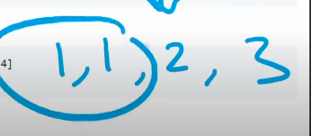
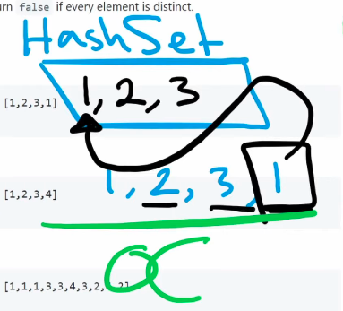

## Leetcode Explanation - Contains Duplicate

*provided by @Neetcode*

[](https://www.youtube.com/watch?v=3OamzN90kPg)
[](https://leetcode.com/problems/contains-duplicate/description/) 

## Drafting & Initial Takeaways

- Multiple solutions available

- Give an int array, return `true` if any value appears at least twice. Otheriwe return `false` if all elements are distinct

## Implementation

* Bruteforce
  
  
  
  * Iterate through every number and compare it to every single number within array
    
    * Checking 1st element's comparison is O(n) but we need to process **every element.**
  
  * Complexities
    
    * Time - O(n^2)
    
    * Space - O(1), no extra data structures needed

* Sorting
  
  
  
  * Sorting all numbers per their values ~ <u>Duplicates will be adjacent!</u>
  
  * Then iterating through entire array to compare every pair
  
  * Complexities
    
    * Time - O(nlogn), sorting and then iterating through arary
    
    * Space - O(1), no extra space needed

* HashSet mapping
  
  
  
  * Checking if an element exists within a **Hashmap**
  
  * While iterating...
    
    * If it doesn't exist, we know the element is NOT a *duplicate*
    
    * If it already exists, it is a duplicate

## Complexity Analysis

* Complexities (for <u>ideal solution</u> *HashSet*)
  
  * Time - O(n), Hashset checking is constant
  
  * Space - O(n), Creating Hashset which can scale to size of 'n'

## Algorithmic Takeways & Tells

* Tracking frequency or presence? <u>Throw a HashMap at it!</u>

## Code

```python
class Solution:
    def containsDuplicate(self, nums: List[int]) -> bool:
        mapping = set()

        for num in nums:
            if num in mapping:
                return True
            else:
                mapping.add(num)
        
        return False
```
