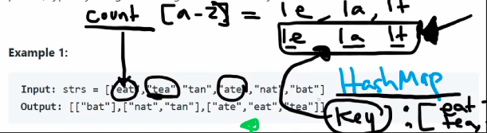

## Leetcode Explanation

*provided by @Neetcode*

[](https://www.youtube.com/watch?v=vzdNOK2oB2E)
[](https://leetcode.com/problems/group-anagrams/description/) 

## Drafting & Initial Takeaways

* Given an array of strings, <u>group the anagrams together</u>.
  
  * Anagram grouping decided based on if one word's letters can be rearranged to form the other word
  
  * Another way to identify anagrams is to sort the strings and check if their equal
    
    * EX: "tan" and "nat", both sorted are "ant"
    
    * However, this is *inefficient* given each string sort requires O(n*logn)

## Implementation



- Anagrams can also be represented as **Counters**, with each char's frequency marked
  
  - Instead of using a bulky HashMap (counter) inside HashMap (fams), <u>**an array of length 26** for characters a-z can be used</u>

## Complexity Analysis

* Time - O(m * n)
  
  * M is total number of input strings given, since we process each string
  
  * N is average length of string, since we count each string's characters
    
    * *count* array of length 26 also used, for O(m * n * 26) but reduced

## Code

```java
class Solution {

    public List<List<String>> groupAnagrams(String[] strs) {
        HashMap<String, List<String>> map = new HashMap<>(); // families
        
        List<List<String>> res = new ArrayList<>();
        if (strs.length == 0) return res;
        
        // Iterate through strings
        for (String s : strs) {
            int[] hash = new int[26]; // Create freq array
            for (char c : s.toCharArray()) {
                hash[c - 'a']++; // Update freq, use char ASCII for indexing
            }
            
            // While an array can't be used itself as a key, it can
            // be converted into a String. 
            String key = new String(Arrays.toString(hash));

            // Initializes new ArrayList if key not present
            map.computeIfAbsent(key, k -> new ArrayList<>());
            map.get(key).add(s);
        }
        
        // Add values to result
        res.addAll(map.values());
        return res;
    }
}
```
