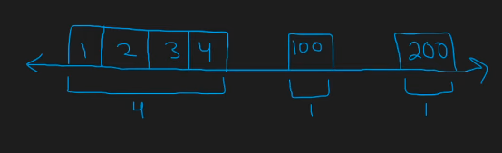
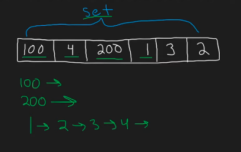

## Leetcode Explanation - Longest Consecutive Sequence

*provided by @Neetcode*

[](https://www.youtube.com/watch?v=P6RZZMu_maU)
[](https://leetcode.com/problems/longest-consecutive-sequence/description/) 

## Drafting & Initial Takeaways

- Given an input array, find the **longest consecutive sequence**
  
  - [10, 4, 9, 8, 7] will yield [7, 8, 9] with 3 sequential elements

## Implementation



* Imagine problem in a "easier format" to better understand
  
  * I.e. a *number-line*

* Looking for trends within the sequences
  
  - Each sequence has a *start value*
  * 1 defining characteristic for each *start* is that they have have <u>no left neighbor</u>



* To identify these start values, utilize **a set** and check for "val-1" (i.e. the left neighbor) within the set
  
  * For all values w/ left neighbors, ignore 
    
    * '2', '1' is present as well, X
  
  * For all values w/o left neighbors,<u> start iterating through *range* starting at that val</u>
    
    * '1', '0' is not present so we continue incrementing and checking 1

* This problem MAY appear as O(n^2), as there is a *while loop* inside a *for*
  
  * HOWEVER, note that for <u>every consecutive value we find when building the sequence</u>, we have **another number with a left neighbor to ignore**
    
    * ... when parsing the original arr

## Complexity Analysis

- **Time** - O(n)
  
  - WORST CASE -> Parse 'nums' and test each val's range for sequence
    
    - Time - O(2n)
  
  - BEST CASE -> Parse 1 long sequence & then iterate rate ofnums
    
    - Time - O(n + (n-1))

- **Space** - O(n)

## Algorithmic Takeways & Tell

- Imagine problems in a "easier format" to better understand

- To check values' presence in *constant time*, utilize **a set**

## Code

```python
class Solution:
    def longestConsecutive(self, nums: List[int]) -> int:
        unique = set(nums)
        max_length = 0

        for n in nums:
            if n-1 not in unique: # no left neighbor, starting value found
                length = 1 

                while n+length in unique: # while val exists, increment
                    length += 1

                # compare w/ max
                max_length = max(max_length, length)

        return max_length
```
