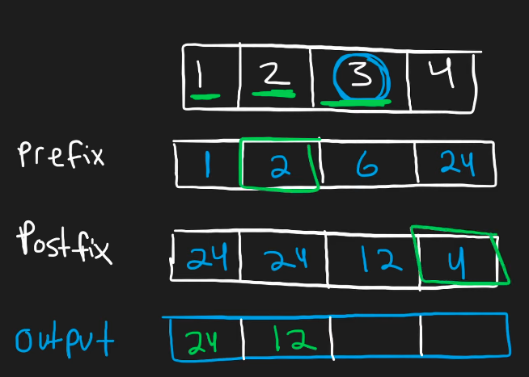
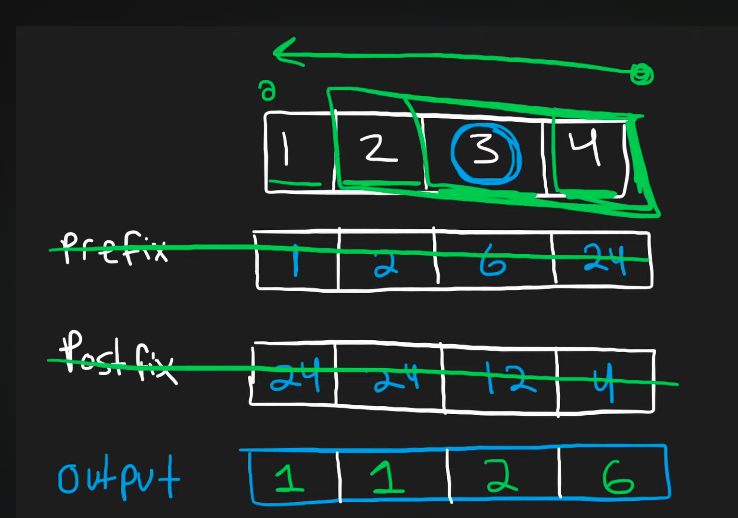

## Leetcode Explanation - Product of Array Except Self

*provided by @Neetcode*

[](https://www.youtube.com/watch?v=bNvIQI2wAjk)
[](https://leetcode.com/problems/product-of-array-except-self/) 

## Drafting & Initial Takeaways

* Given int array of `nums`, return an arr where output[i] is the product of all nums elements, <u>excluding nums[i]</u>
  
  * EX: [1, 2, 3, 4] -> [24, 12, 8, 6]

* Constraints
  
  * Must solve in O(n) - linear time
  
  * Cannot use the division operator
    
    * Brings difificulty bc a simple solution would be to find the entire product, and divide by each indexed element

## Implementation

* Use 2 additional arrays - *prefix* and *postfix*
  
  * **Prefix** - array storing products of elements <u>before an index</u>
  
  * **Postfix** - array storing products of elements <u>after an index</u>



* When calculating output, grab the associated prefix & postfix values and multiply them
  
  * O(n) time complexity 
    
    * 3 arr iterations - 1 creating prefix, 1 creating postfix, 1 calculating output
  
  * However, O(n) space complexity is incurred in accommodating arrays

* To optimize this *space complexity* from **O(n) to O(1)**...
  
  * Prefixes & Postfixes can be <u>sequentially calculated and stored in the output</u>
  
  * **Process**
    
    
    
    1. Iterate through nums for *prefixes*
       
       1. Use a starting value of `pre` = 1
       
       2. Store in output[i] the value of *pre* and multiply it by nums[i]
    
    2. Iterate backwards through nums for *postfixes* (start at idx *len-1*)
       
       1. Use a starting value of `post` = 1
       
       2. Multiply output[i] by the value of *post* and multiply post again by nums[i]
  
  * Resulting *output* will be<u> the products of all respective prefixes & postfixes</u>

## Complexity Analysis

* Time - O(n)
  
  * 2 iterations, 1 factoring in *prefixes* and 1 factoring in *postfixes*

* Memory - O(1) or O(n)
  
  * Depends on <u>if output array is counted</u>!

## Algorithmic Takeways & Tells

* Requiring a *better* time complexity generally means a *worse* memory complexity
  
  * But memory can be optimized by <u>utilizing output structures!</u>

* Identify patterns within bruteforce solutions
  
  * The 2-for loop solution is **also** calculating the *prefix* & *postfix*

## Code

```python
class Solution:
    def productExceptSelf(self, nums: List[int]) -> List[int]:
        length = len(nums)
        ans = [1] * length

        # Tracking & storing num prefixes at every 'i' idx
        pre = 1
        for i in range(length):
            ans[i] = pre
            pre *= nums[i]
        
        # Tracking & applying num postfixes at every 'i' idx
        post = 1
        for i in range(length-1, -1, -1):
            ans[i] *= post
            post *= nums[i]
        
        return ans
```
