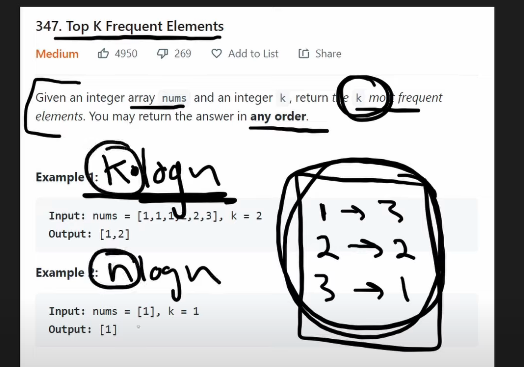
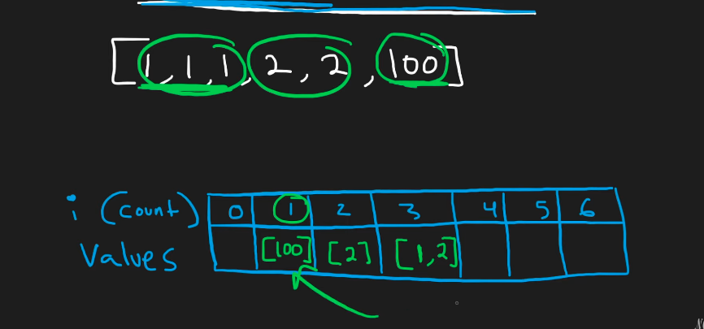

## Leetcode Explanation - Top K Frequent Elements

*provided by @Neetcode*

[](https://www.youtube.com/watch?v=YPTqKIgVk-k)
[](https://leetcode.com/problems/top-k-frequent-elements/description/) 

## Drafting & Initial Takeaways

- Given an int array `nums`, return the `k` most frequent elements.
  
  - May be returned in <u>any order</u>

## Implementation

- Hashmap solution
  
  - Use a HashMap to track elements freq. in `nums` and then sort according to its *values*
  
  - Sorting in the *worst case* results in time **O(n logn)**



- MaxHeap solution
  
  - All of the HashMap's values do NOT need to be sorted, only the <u>`k` number of most frequent elements </u>
  
  - To pursue this, a *MaxHeap* is initialized from the hashmap
    
    - Initializing heap - Heapify() - Occurs in *O(n)* time
    
    - Pop elements from heap - Occurs in *O(log n)* time
  
  - Therefore, solving via a *MaxHeap* results in time **O(k logn)**

- But a better solution exists... Bucket Sort
  
  - Traditionally *bucket sort* includes using an array and mapping its indices to elements and storing inside the elements' freq.
    
    - Element '1' is present twice, go to structure index 1 and insert 2
  
  - This approach **is limited**
    
    - Array's size must scale up to the *largest number* within *nums*
    
    - Not clear on where most frequent elements are located
  
  
  
  - However, we can **improve this approach** by <u>switching up the indices' & value mapping</u>
    
    - Use an array and map the indices to the FREQUENCY and inserting LISTS that hold all the values w/ that freq
      
      - EX: 3 occurs twice. At index '2', a list [3] is inserted.
      
      - We continue process and find 7 is present twice. At index '2', we append 7 to the list, yielding [3, 7]
    
    - By this method, the array will not scale to the *largest number*, it will actually scale to the *largest possible freq* an element could have
      
      - Which is **len(n)**, substantially smaller!
    
    - Once all elements processed, <u>start from the array's end </u>to yield the *most frequent elements*
      
      - Add to output the first 'k' values processed (continue iterating backwards)

## Complexity Analysis

- Time - O(3n) -> **O(n)**
  
  - 1 iteration to initialize HashMap, 1 iteration to place into array of lists, 1 iteration to check array in reverse

- Space - O(2n) -> **O(n)**
  
  - Hashmap tracking frequencies
  
  - Array storing lists of elements at certain freqs.

## Algorithmic Takeways & Tells

- When tracking frequency, utilize a HashMap

- When optimizing HashMaps, observe whether the relationship between *key* and *val* can reversed
  
  - Does a *value* have to be a single element? Can it be a <u>*collection*</u>? 

## Code

```python
class Solution:
    def topKFrequent(self, nums: List[int], k: int) -> List[int]:
        char_freq = Counter(nums) # Tracking all char frequencies
        freqs = [[] for i in range(len(nums)+1)] # Index 0 kept for readability

        # Adding chars to 'freqs' array
        for val, count in char_freq.items():
            freqs[count].append(val)

        # Iterating 'freqs' backwards to grab most frequent elements
        output = []
        for i in range(len(freqs)-1, -1, -1):
            for num in freqs[i]:
                output.append(num)

                if len(output) == k: # 'k' met, return
                    return output
        
        return output
```
