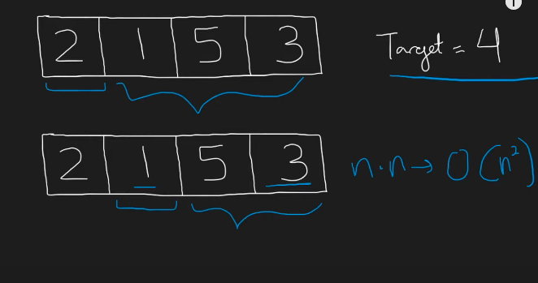
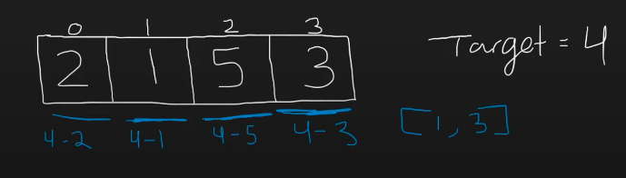
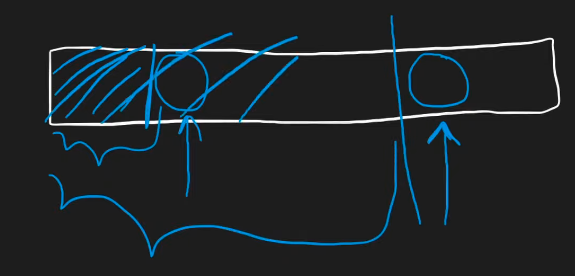

## Leetcode Explanation

*provided by @Neetcode*

[Two Sum - Leetcode 1 - HashMap - Python - YouTube](https://www.youtube.com/watch?v=KLlXCFG5TnA)

### Initial Takeaways

* Guaranteed 1 solution, so no worrying about multiple solutions

## Solutions

Most intuitive approach - checking every combination between every number for if sum equals *target*.



* Also known as **Bruteforce** - Worst time complexity is O(n^2)

To improve this time complexity, we can recognize that in order for 1 number to be able to be apart of a sum towards the *target*, its **exact counterpart** (i.e. complement) msut be present.

To check if the complement is present, a HashMap can be utilizied.

* Stored inside the HashMap can be <u>every value's index</u>

## Implementing the HashMap

* One tendency may be to compeltely initialize the HashMap first, then begin checking values
  
  * However, this approach is WRONG as it causes single values to be used
  
  * Ex: target is 4, value is 2, 4-2 = 2, 2 exists in the HashMap. Despite 2 only existing once and being a false pair, it is selected

* Instead, add elements to the HashMap *after visiting them*!



* Why does this approach work?
  
  * When visiting a certain element, the HashMap's contents will only include all the elements BEFORE this certain element.
  
  * If this certain element does a complement BUT the complement has not been mapped, the program will still function correctly
    
    * Because once the complement is visited, <u>the elements before it will include that certain element</u>



## Complexity Analysis

* Time - O(n)
  
  * Only 1 array iteration is needed
  
  * Adding to HashMap & checking if a value exists are constant time operations

* Space Compelxity - O(n)
  
  * In worst case, all array's elements will be added to HashMap

## Code

```java
class Solution {

    public int[] twoSum(int[] nums, int target) {
        HashMap<Integer, Integer> prevMap = new HashMap<>();

        for (int i = 0; i < nums.length; i++) {
            int num = nums[i];
            int diff = target - num;

            if (prevMap.containsKey(diff)) {
                return new int[] { prevMap.get(diff), i };
            }

            prevMap.put(num, i);
        }

        return new int[] {};
    }
}
```
