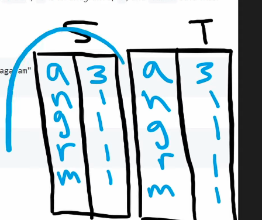
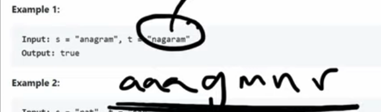

## Leetcode Explanation - Valid Anagram

*provided by @Neetcode*

[](https://www.youtube.com/watch?v=9UtInBqnCgA)
[](https://leetcode.com/problems/valid-anagram/description/) 

## Drafting & Initial Takeaways

* Given two strings 's' & 't', return `true` if both strings are *anagrams*, otherwise `false`
  
  * Anagram = Strings w/ same # of characters, but rearranged

* If they are anagrams...
  
  * Same # of total characters
  
  * Same # of each character

## Implementation

* Using Hashmaps...
  
  
  
  * ***2 Hashmaps* for each string**
    
    * Track frequencies for each character in both
    
    * Once built, <u>iterate through keys & compare</u>
      
      * First ensure maps have the same length
      
      * Then iterate through 1 map's keys for comparison
    
    * Complexity
      
      * Time  - O(s+t), iterating through the two strings
      
      * Memory - O(s+t), 2 hashmaps of sizes
  
  * **1 Hashmap for both strings**
    
    * First track frequencies of string 's' 
    
    * Then iterate through 't' and decrement its respective frequency
    
    * If all keys are mapped to 0, the strings <u>are anagrams</u>
      
      * If not (either a positive or negative value present), their frequencies *differ* & they <u>are not anagrams</u>

* Counter implementation
  
  * Use `Counter(s)` & `Counter(t)` to quickly track frequencies and compare
  
  * *May not be counted in an interview*

* **Sorting**
  
  
  
  * If both strings have same # of each character, when they are *sorted*, they will be <u>equivalent</u>

## Complexity Analysis

* Complexity of *1 HashMap solution*
  
  * Time - O(s + t), iterate through both strings
  
  * Memory - O(s), 1 map containing # of keys

* Complexity of *Sorting*
  
  * Time - O(nlogn), sorting both strings
  
  * Memory - O(1`), no data strucres needed

## Algorithmic Takeways & Tells

* HashMap are traditionally used for tracking frequency and presence, <u>but **sorting** can be an effective tool for trading off Time for less Memory</u>

## Code

```python
class Solution:
    def isAnagram(self, s: str, t: str) -> bool:
        if (len(s) != len(t)): # If not same length, not an anagram
            return False

        freq = {}
        for c in s:     # Init map & increment freqs
            if c not in freq:
                freq[c] = 1
            else:
                freq[c] += 1

        for c in t:     # Decrement key freqs, return False if not present
            if c not in freq:
                return False
            else:
                freq[c] -= 1

        # If all values are not 0, freqs are diff. Return False, else True
        return not any(freq.values())
```
