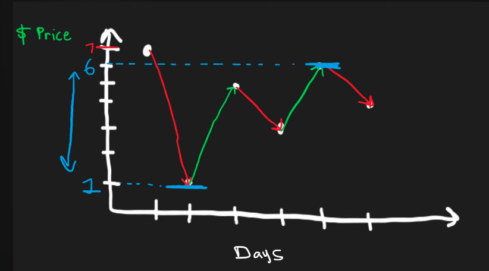
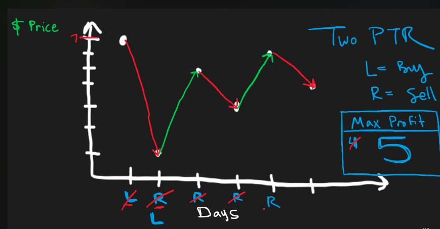

## Leetcode Explanation - Best Time to Buy and Sell Stock

*provided by @Neetcode*

[](https://www.youtube.com/watch?v=1pkOgXD63yU)
[](https://leetcode.com/problems/best-time-to-buy-and-sell-stock/description/) 

## Drafting & Initial Takeaways

- Given an int arr representing a stock's daily prices, find <u>one</u> transaction that maximizes the profit of *buying* and *selling*

## Implementation

- Visual representation
  
    
  
  - The max profit is found by finding the <u>lowest point</u> and its <u>highest point</u> within the subsequential values
  
  - Notice that days 0 & 1 has a larger difference with `1` and `7`, but since the buy-in is AFTER the sell, <u>the transaction cannot occur</u>

- Procuring these *sequential* values...
  
  
  
  - **Two Pointers** is utilizied
    
    - The left pointer tracks the buy-in point
    
    - The right pointer tracks the current sell point
  
  - The *left* ptr is updated when<u> the *right* ptr finds a buy-in less than the current</u>
  
  - The *right* ptr continuously processes through `prices` , calculating & comparing the yield with the stored max

## Complexity Analysis

- Time - O(n)
  
  - Iterates through `prices`

- Memory - O(1)
  
  - No additional data structures w/ varying length
  
  - Constant # of vars used

## Algorithmic Takeways & Tells

- A **Sliding Window**-like solution is present here for the two ptrs mark the *start* and *end* of the values we're considering
  
  - It requires a sequential iteration & periodically excluding past values based on the state

## Code

```python
def maxProfit(self, prices: List[int]) -> int:
    profit = 0
    buy = None

    for i in range(len(prices)): # Process prices
        # Set new buy-in if 1) None or 2) Costs less
        if buy is None or prices[i] < prices[buy]:
                buy = i
        else:   # Stock costs more, compare profit w/ cur max
            profit = max(profit, prices[i]-prices[buy])

    return profit
```
