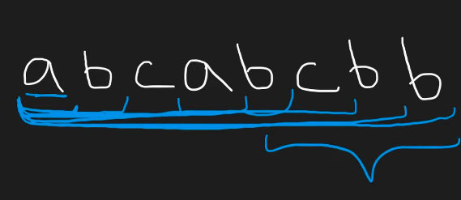
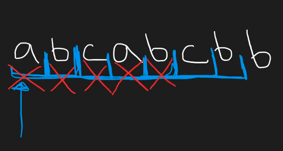

## Leetcode Explanation - Longest Substr w/o Repeating Chars

*provided by @Neetcode*

[](https://www.youtube.com/watch?v=wiGpQwVHdE0)
[](https://leetcode.com/problems/longest-substring-without-repeating-characters/description/) 

## Drafting & Initial Takeaways

* Given a string, find the <u>longest substr</u> without any duplicate characters and return the **length**

## Implementation

* *Brute-force* - Find all substrings, filter out ones w/ repeating chars, then return longest one's length
  
  
  
  * PROBLEM: Despite finding a repeating char at idx 4, continue processing in order to "find all substrings"
    
    * Wasted computation
  
  * To prevent this, we implement **Sliding Window**

* *Sliding Window* - Process substrings and when repeated chars are found, remove the original char
  
  
  
  * To identify duplicates, <u>use a Set to check in constant time</u>
  
  * Removing characters...
    
    * The dupe is at the window's *start*? Only remove the dupe!
    
    * Dupe is in the *middle* of the window? Remove the dupe AND <u>its preceding terms!</u>
  
  * When removing terms, remember to erase from Sliding Window and Set (for checking presence)

## Complexity Analysis

- Time - **O(n)**
  
  - Iterate through entire list for processing

- Memory - **O(n)**
  
  - Set to holding unique terms, depends on input 's' str size

## Algorithmic Takeways & Tells

* When implementing Sliding Windows, visualize <u>2-pointers</u> and how the *start* and *end* need to be stored & updated in maintaining the active str

* 2 embeeded loops <u>does NOT always mean quadratic time</u>
  
  * A`while` may consistently process a conditional statement depending on the str's values, not its size

## Code

```python
class Solution:
    def lengthOfLongestSubstring(self, s: str) -> int:
        charSet = set()
        l = 0
        res = 0

        for r in range(len(s)):
            while s[r] in charSet:
                charSet.remove(s[l])
                l += 1
            charSet.add(s[r])
            res = max(res, r - l + 1)
        return res
```
