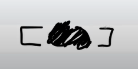
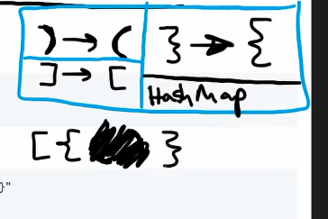

## Leetcode Explanation

*provided by @Neetcode*

[](https://www.youtube.com/watch?v=WTzjTskDFMg)

[](https://leetcode.com/problems/valid-parentheses/)

## Drafting & Initial Takeaways

* Can't ever start with a clothing parenthesis, bc nothing is open

* When starting w/ an opening parenthesis, you can start with as many as you want
  
  * So long as they are closed accordingly later

* When parentheses are closed, they can be removed from future consideration

## Implementation

- When removing parentheses, it will occur at front and end's of 1st parentheses considered
  
  - Closing parentheses will be matched to **most recent** opening parentheses. From this, we can reason a **stack** would be most applicable



- To ensure a closing parentheses *closes* an open parentheses, a relationship needs to be established
  
  - This can be done so using a **HashMap**



## Complexity Analysis

- Time - O(n)
  
  - Will iterate through entire string's characters once

- Space - O(n)
  
  - Stack which can scale up to 'n', string's size if all opening parentheses

## Code

```python
class Solution(object):
    def isValid(self, s):
        """
        :type s: str
        :rtype: bool
        """

        stack = []
        pairs = {
            ')':'(',
            '}':'{',
            ']':'['
        }

        for b in s:
            if b not in pairs: # Open bracket
                stack.append(b)
            else:  # Closing bracket
                # No open pairs present OR non-corresponding brackets
                if not stack or stack.pop() != pairs[b]:
                    return False

        # True if list empty, False if values present
        return not stack
```
