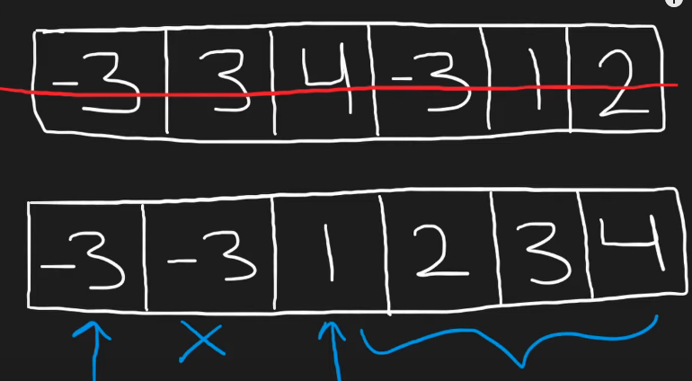
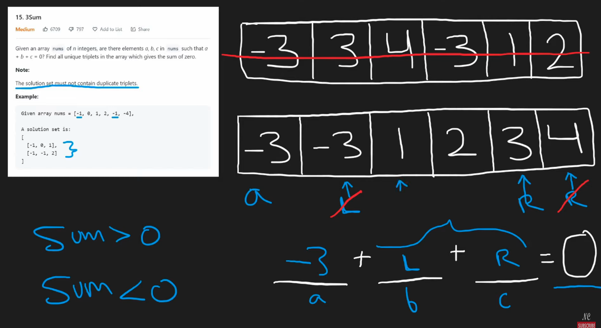

## Leetcode Explanation - 3Sum

*provided by @Neetcode*

[](https://www.youtube.com/watch?v=jzZsG8n2R9A)
[](https://leetcode.com/problems/3sum/description/) 

## Drafting & Initial Takeaways

* Given an array of `nums`, identify all unique triplets that sum up to **0**
  
  * Arr can contain duplicate values
- The traditional approach may be 3 nested *for* loops, however this would result in duplicate triplets!
  
  - Utilize a Set? -> This <u>does not improve computation time</u>

- Note that 3Sum is solved via combining Two Sum & Two Sum II

## Implementation



* To counteract the *duplicates*, recognize that when the arr is **sorted**, all duplicates will be <u>adjacent within the arr</u>

* Finding our 3 values...
  
  * First, identify the *base* term to be paired with the other 2 terms
    
    * Use a simple *for* loop to iterate
    
    * NOTE that due to being sorted, if the *base* is at idx **i** and nums[i] == nums[i-1], it is a duplicate!
      
      * In this case, use `continue` to skip this iteration
  
  * For the other 2 values, introduce a **two pointer** approach that checks if all vals add up to 0
    
    
    
    * NOTE that due to being sorted, <u>the Sum can be accordingly increased/decreased by modifying the pointers</u>
      
      * Too large a sum? -> **Decrease the `end` ptr**
      
      * Too small a sum? -> **Increase the `start` ptr**
  
  * If 0, add this triplet pair to our output
  
  * Updating the ptrs after a *successful* pair...
    
    * While we are checking duplicates for the *base*, note that dupes can also be present in our <u>other 2 terms</u>
    
    * To counteract this, introduce a while loop that ensures that for 1 ptr **j** that nums[j] != nums[j-1]
      
      * <u>Only 1 ptr needs to be checked</u>, bc the triplet pair only needs 1 val changed to become **invalid** 

## Complexity Analysis

- Time - **O(n^2)**
  
  - O(nlogn) to sort
  
  - O(n^2) to perform TwoSum for every *nums* val in nums

- Memory - **O(1)** or **O(n)**
  
  - Depends on if built-in sort library uses memory

## Algorithmic Takeways & Tells

- <u>Sorting helps track and eliminate duplicates!</u>

- In solving complex problems, look into <u>applying simpler approaches iteratively</u> onto larger datasets

## Code

```python
class Solution:
    def threeSum(self, nums: List[int]) -> List[List[int]]:
        res = []
        nums.sort() # Sort nums, groups dupes together

        # Iterate thru nums for 'base'
        for i, val in enumerate(nums):
            if i > 0 and val == nums[i-1]: # If dupe found, skip iteration
                continue

            # Perform TwoSum using 2-ptr on remaining vals
            s, e = i+1, len(nums)-1
            while s < e: # Iterate until crossing
                new_sum = val + nums[s] + nums[e]

                if new_sum > 0: # Sum > 0, decre. 'e'
                    e -= 1
                elif new_sum < 0: # Sum < 0, incre. 's'
                    s += 1
                else: # Sum == 0, valid triplet
                    res.append([val, nums[s], nums[e]])
                    s += 1

                    # Dupe check -- Incre. 's' until non-dupe found
                    while nums[s] == nums[s-1] and s < e:
                        s += 1

        return res
```
