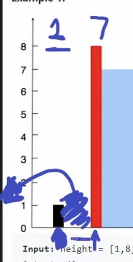
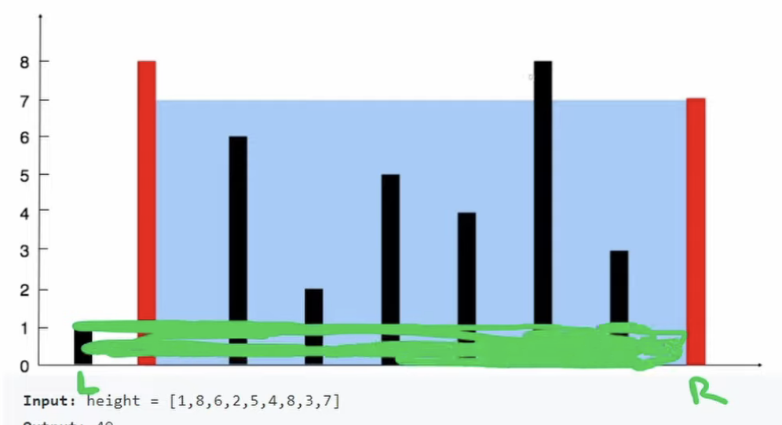
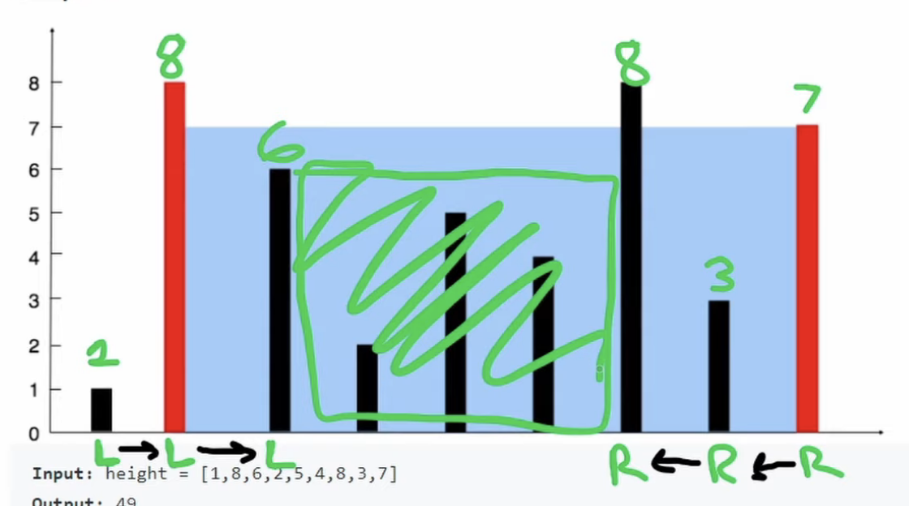

## Leetcode Explanation - Container With Most Water

*provided by @Neetcode*

[](https://www.youtube.com/watch?v=UuiTKBwPgAo)
[](https://leetcode.com/problems/container-with-most-water/description/) 

## Drafting & Initial Takeaways

* Given an array `heights`, find the <u>largest area formed by a container</u> from 2 heights
  
  * Utilize the distance between heights (on x-axis) in calculating

## Implementation

* Bruteforce
  
  * Compare every possible height with each other & iterate through array
  
  * **Bottleneck**
    
    
    
    * Notice when comparing heights that the container's amount <u>is limited by the shortest height</u>
  
  * Time complexity of O(n^2)

* Two Pointers
  
  * Initialize 2 ptrs - 1 ptr *all the way* left and 1 ptr *all the way* right
    
    * `L` & `R`
  
  * Calculate amount between 2 heights when processing
  
  * End processing once ptrs cross each other
  
  * **Updating pointers...**
    
    
    
    * Analyze the 2 heights & identify the height which is restricting the container's amount
      
      * Notice a similarity with the *bottleneck*
    
    * The ptr to be updated is the <u>shortest height present</u>
      
      * Incre./decre. the *bottleneck* ptr accordingly
    
    * Note that since the ptrs start on opposite ends, i.e. <u>the furthest apart</u>, any updates NOT applied to the bottleneck are  **guaranteed to yield a smaller amount**
      
      * Therefore, shifting the shorter one affords us the *potential* for an increase
  
  * Processing diagram
    
    

## Complexity Analysis

- Time - O(n)
  
  - 2 ptrs that are updated every iteration
  
  - Will cross once 'n' iterations occur, i.e. linear

- Space - O(1)
  
  - No additional structures corresponding to 'n' size

## Algorithmic Takeways & Tells

* When calculating a *possible* answer to a solution, <u>identify its restrictions</u> and whether these can be <u>directly addressed</u>
  
  * EX: the *bottleneck* in bruteforce

* When using an *unsorted* arr, apply **Two Pointers**

## Code

```python
class Solution:
    def maxArea(self, height: List[int]) -> int:
        l, r = 0, len(height) - 1
        res = 0

        while l < r: # While ptrs have not crossed
            # Calc amount & compare w/ max
            res = max(res, min(height[l], height[r]) * (r - l))

            # Update ptr at bottleneck
            if height[l] < height[r]:
                l += 1
            else:
                r -= 1
        return resaa
```
