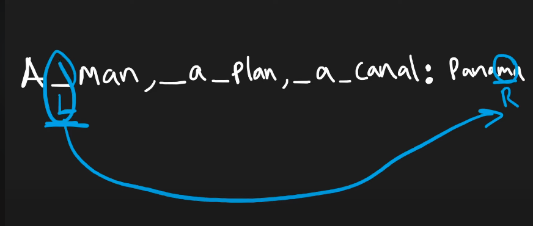

## Leetcode Explanation - Valid Palindrome

*provided by @Neetcode*

[](https://www.youtube.com/watch?v=jJXJ16kPFWg)
[](https://leetcode.com/problems/valid-palindrome/description/) 

## Drafting & Initial Takeaways

- Comparing specific elements within a *str* on opposite ends -> **Two Pointers**

- Requires method for converting to "lowercase, alphanumeric" version

## Implementation

* Conversion methods...
  
  1. Initially iterate through `s` and join into new str for only *alphanumeric* chars, then use *lower()* on the result
  
  2. **OR** during while loop, also incre/decre. ptrs when an invalid char is found

* **Two Pointers** processing
  
  
  
  * Create 2 ptrs, 1 at str's start and 1 at str's last character
  
  * Use a while loop <u>dependent on when these ptrs "cross"</u>  (i.e. *end* < *start*)
    
    * If chars at ptrs are *equal*, incre/decre ptrs and continue processing
      
      * Moves them closer to crossing
    
    * Results
      
      * If chars are *unequal*, exit and return **False**
      
      * If while loop successfully completes, return **True**
  
  * Palindrome validity...
    
    * If the loop exits, <u>all chars at every comparison were equal</u>
      
      * Meaning the string can be read the same frontwards & backwards, i.e. a *Palindrome*
    
    * If one unequal comparison is found, the str differs per its orientation and is  NOT a *Palindrome*

## Complexity Analysis

* Time - O(n), incre/decre ptrs according to s's length

* Memory - O(1), input string can be processed & ptrs used is constant

## Algorithmic Takeways & Tells

- Checking for<u> reversals?</u> Two Pointers!

## Code

```python
class Solution:
    def isPalindrome(self, s: str) -> bool:
        # Converting to lowercase & alphanumeric-only
        s = (''.join(c for c in s if c.isalnum())).lower()
        start, end = 0, len(s)-1

        # Two ptr approach
        while start < end:
            if (s[start] != s[end]): # Chars at opposite ends aren't == -> False
                return False
            else: # Chars are equal, incre/decre accordingly
                start += 1
                end -= 1

        return True
```
