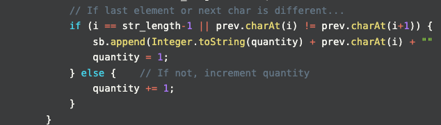

## Leetcode Explanation

*provided by @Aman Shrivastava*

[](https://www.youtube.com/watch?v=_vzVGhKt70o)
[](https://leetcode.com/problems/count-and-say/description/) 

## Drafting & Initial Takeaways

* Needs to operate based on initial case of "countAndSay(1) = "1"", so *iterating the recursive stack* until this case may be necessary

## Implementation

* To procure the **base case**...
  
  * Implement an if-statement for base case's certain condition & recursive calls underneath

* When iterating through the string's characters...
  
  * Recognize that for every character, <u>the quantity will never be 0</u>, instead 1.
    
    * Bc if you're accessing it, atleast 1 character exists


* Checking when end the "spoken string"
  
  * When the next character differs with your current, the string is ending
  
  * Here, add the char & its current quantity to a mutable String (StringBuilder in Java)
    
    * Reset quantity to 1 for the next, new character
  
  * If the next character DOESN'T differ, increment quantity



* Return this execution's "spoken string" to be iterated on by previous executions i.e. recursion done prior

## Complexity Analysis

* Time - O(n*M)
  
  * M is the longest sequence length

* Space - O(n)

## Code

```java
class Solution {

    public String countAndSay(int n) {
        if (n==1) {     // Base case
            return "1";
        }

        String prev = countAndSay(n-1); // Recurse until base case met

        StringBuilder sb = new StringBuilder();
        int quantity = 1;
        int str_length = prev.length();

        // Iterate through string's characters
        for (int i = 0; i < str_length; i++) {
            // If last element or next char is different...
            if (i == str_length-1 || prev.charAt(i) != prev.charAt(i+1)) {
                sb.append(Integer.toString(quantity) + prev.charAt(i) + ""); // Append to string and reset quantity
                quantity = 1;
            } else {    // If not, increment quantity
                quantity += 1;
            }
        }

        // Return formed string to prev executions until finished
        return sb.toString();
    }
}
```
