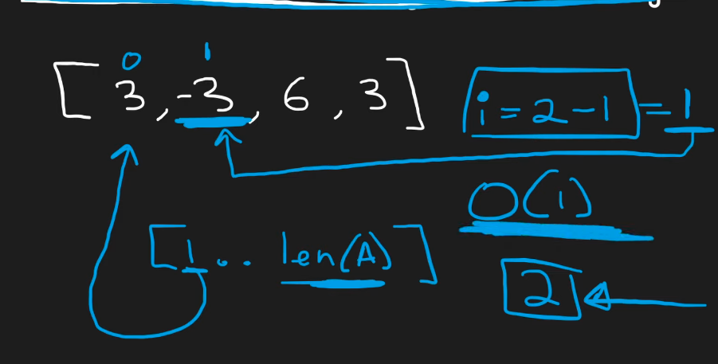
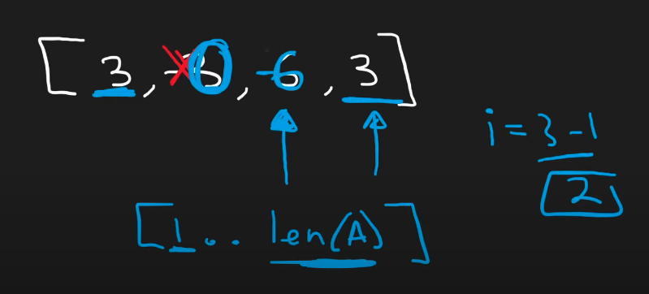
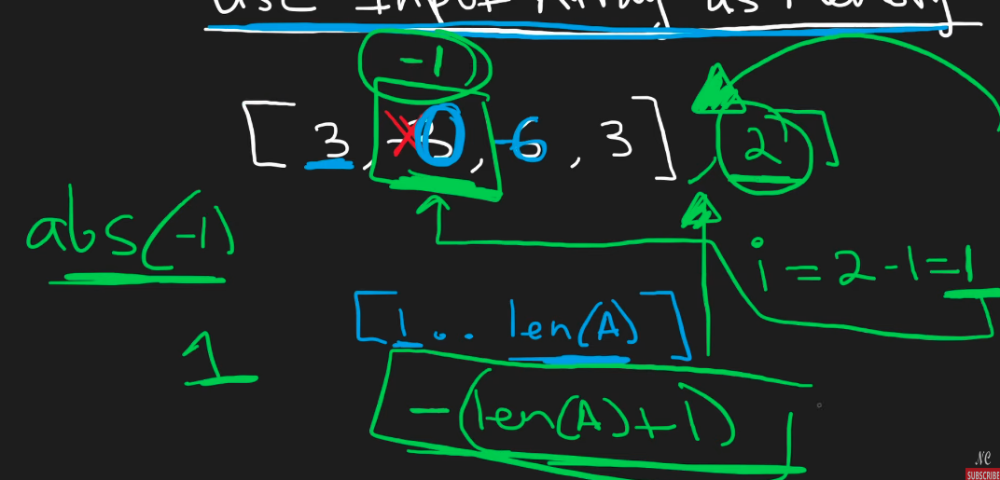

## Leetcode Explanation - "First Missing Positive"

*provided by @Neetcode*

[](https://www.youtube.com/watch?v=8g78yfzMlao)
[](https://leetcode.com/problems/first-missing-positive/description/) 

## Drafting & Initial Takeaways

* We are looking for a question with **O(n) time and O(1) memory**
- What is smallest positive integer generally?
  
  - Starts at 1, then 2, then 3
  
  - One implementation is starting at '1' and iterating until 1 is found, then incrementing, and repeating this process
    
    - Requires *nums* input to be sorted
      
      - To avoid finding our desired minimum after passing our NEXT desired minimum
        
        - [1, 3, 2]  - incorrectly derives smallest missing pos int '3'
    
    - When an element is found that is greater than our current minimum, we know every element afterwards is <u>also greater</u>

## Implementation

- What is smallest positive integer in worst case?
  
  - 'len(A) - 1!' (size of input *nums*)
    
    - If array is sequential [1, 2, 3], answer is 4
      
      - 'n' belongs to [1 ... len(A) + 1]
    
    - All other answers have a ceiling of 4
  
  - Therefore, instead of *sorting*, <u>a <strong>HashTable</strong> can be used to track freq. w/o ordering</u>
    
    - If all values in len(A) found in Hash, return len(A) + 1


* Time Complexity of HashMap approach
  
  * Time - O(n) - Storing every element in Hash then referencing in constant time
  
  * Memory - O(n) - Hash scales to store all elements
    
    * This approach uses *too much memory*, however the HashTable can be excluded
      
      * Instead, the **input array itself** can be used!

* Input Array approach...
  
  * Value to Index mapping
    
    * Smallest pos integer 1 wil lbe mapped to index 0 
    
    * Largest pos integer 'len(A)' will be mapped to 'len(A) -1
  
  * To check if 2 is present, check the '1' index...
  
  * If element at index '1' is negative, then the element exists elsewhere
    
    * *Explained more in a later step*
    
    * However, the array <u>can have negatives by default</u>, which obstructs this pattern
  
  
  
  * Yet negatives do not matter to us, so let's remove all negatives within the array
    
    * Change all negative values to 0 (doesn't impact smallest missing positive)
      
      * Time - O(n)
  
  * EX: Mapping & applying negative symbols on [3, -3, 6, 3]
    
    1. Change all negatives to 0 -> [3, 0, 6, 3]
    
    2. Get 1st element '3' and check mapped index 2
    
    3. If value is positive, change value at index- to *negative*
       
       1. [3, 0, -6, 3]
       
       2. Since value can be negative, we are using <u>abs(x) -1</u> to properly find the mapped idx
    
    4. If value is 0, mapped index is -1 and is "out of bounds" -> ignore the value!
    
    5. At [3, 0, -6, 3], we process -6 and get index 5, which is "out of bounds" again
    
    6. At the last element, we process 3 to get index 2
       
       1. Element at index 2 is already negative, so we leave it
       
       2. We WANT to know that a '3' exists elsewhere in the array, and to not modify this info
  
  
  
  * Afterwards, we begin iterating on [1.. len(A)] - smallest positive integer range
    
    - The val is mapped to the index 'val-1'
    * Index 'val-1' is checked...
      
      - If it's *negative*, 'val' exists in the array. Continue processing
      * If it's *positive*, <u>'val' DOESN'T exist in the array.</u> Return as smallest, missing positive int
  - Iterating through [1...len(A)] is O(n) complexity
  
  - Final edge case
    
    - What if an element is found that maps to an index, which previously *held a negative*?
      
      - i.e. [3, 0, -6, 3, 2] - 2 maps to index '1' but '1' is 0. How do you track 2's presence?
        
        - Can't turn 0 into a negative
        
        - Can't change to a -1 bc not we're suggesting element 1 originally existed in the array
    
    - Solution is turn into '- (len(A) + 1'
      
      - len(A) + 1 doesn't fit in the smallest positive integer range, so it will never be factored into changing history of which elements exist
      
      - Since an indexed element w/ a value of 0 <u>doesn't need to have its original element considered</u>, multiple values can be changed to '-len(A) +1'
        
        - The mapping to the index itself tells you which element is being checked
  
  

## Complexity Analysis

- Time - O(n)
  
  - 3 array iterations
    
    - 1 to remove negatives, 1 to map elements to indices, 1 to check signs

- Space - O(1)
  
  - Input array not counted & no additional structures created

## Code

```java
class Solution {
    public int firstMissingPositive(int[] nums) {
        int length = nums.length;

        // removing negatives
        for (int i = 0; i < length; i++) {
            if (nums[i] < 0) { // neg found, set to 0 
                nums[i] = 0;
            }
        }

        // mapping indices via negative signs
        for (int i = 0; i < length; i++) {
            int idx = Math.abs(nums[i]) - 1; // mapped index

            if (idx >= 0 && idx < length) { // check if valid range
                if (nums[idx] > 0) { // pos int, change to negative
                    nums[idx] *= -1;
                } else if (nums[idx] == 0) {  // 0, change to (-a+1), marks as exists
                    nums[idx] = -1 * (length+1); // by being > length, existing tracking is not altered!
                }
                // if negative already, duplicate element so ignore to maintain element tracking
            }
        }

        // checking element symbols
        for (int i = 1; i < length+1; i++) {
            if (nums[i-1] >= 0) { // positive or 0 means never mapped!
                return i;
            }
        }

        return length+1;
    }
}
```
