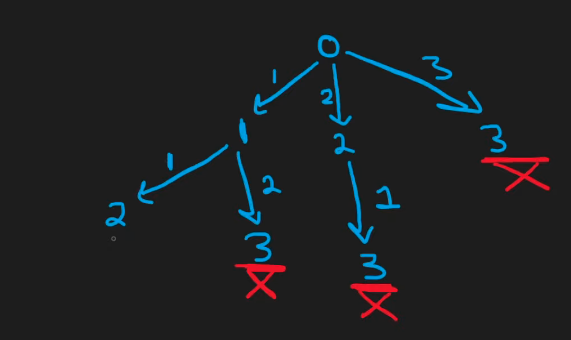
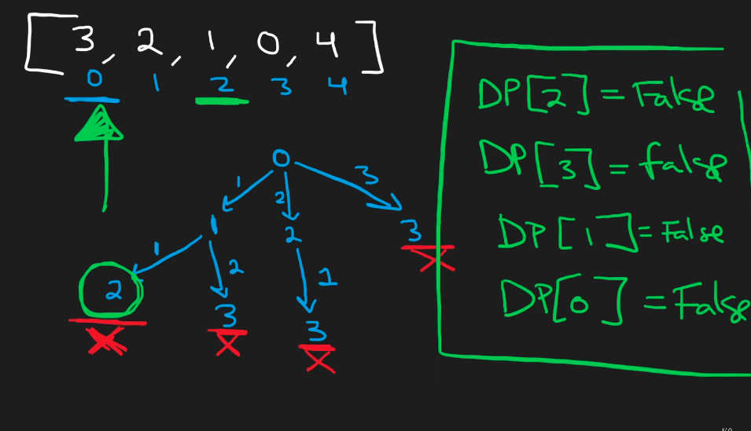
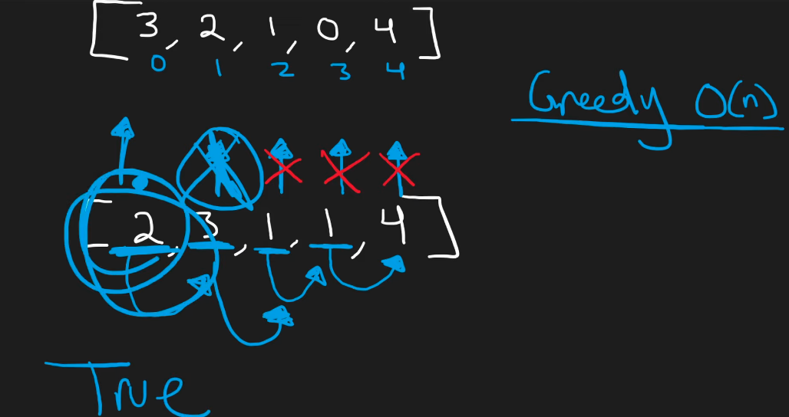

## Leetcode Explanation - JumpGame

*provided by @Neetcode*

[](https://www.youtube.com/watch?v=Yan0cv2cLy8)
[](https://leetcode.com/problems/jump-game/description/) 

## Drafting & Initial Takeaways

* Overview
  
  * Given an input array, you are positioned at index 0 
  
  * Each element within array represents maximum jump length
    
    * EX: [2, 3, 1, 1, 4] - at 0, you can jump a max of 2 indices
      
      * Can travel to either index '1' or '2'
  
  * Determine if an array can reach the last index

## Implementation

* Consider [3, 2, 1, 0, 4]
  
  * Common brute-force algorithm -> "Check every possible path"
    
    * Index 0 ('i') has max jump of 3, can jump to indices "'i' + [1,3]"
  
  * Upon checking every index within "i + [1,3]", we always meet 0 at index 3
    
    * Therefore, <u>there are no possible pathes leading to the last index</u>
  
  
  
  * Time - O(n^n)
    
    * Can be optimized via caching
      
      * [0 -> 2  > 3 ] - Index 3 is 0, **X**, WON'T WORK
      
      * [0 -> 1 -> <u>2</u> -> 3] - Index 3 is 0...
        
        * But we have already checked index 2, so we don't need to check again
      
      * Utilize a bool array to indicate index 2 is invalid, so <u>when it reaches it again on future pathes</u>, it gets *ignored
    
    * Using a cache, time complexity of **O(n^2)**



* Implement a *greedy algorithm* for O(n), linear time
  
  * We are trying to get from index 0 to the last index, but *what if* <u>we started at the last index and **worked backwards?**</u>
  
  * Shifting the goal posts
    
    * If an index is found that can reach the *last index*, the goal becomes reaching this new index
    
    * This process continues **iterating backwards** to check if elements can reach
      
      * If a new element can reach far beyond the new goal post, <u>it's unnecessary</u>
        
        * The path to the last index is guaranteed either way
  
  * If start index is reached, a path between the start & end exists



## Complexity Analysis

* Time - O(n)
  
  * Goalpost shifting during 1 iteration of array

* Space - O(1)
  
  * No extra memory required
    
    * No cache, data structures, nor trees

## Algorithmic Takeways & Tells

* When operating on problems w/ a start and multiple pathes to an endpoint, <u>check if working backwards (endpoint to start) is possible</u>

* For brute-force algorithm, remember when working with branching paths that <u>paths can be cached</u> for *optimization* 

## Code

```java
class Solution {

    public boolean canJump(int[] nums) {
        int goal = nums.length - 1;

        // iterate nums in reverse, starting at 2nd last idx
        for (int i = nums.length - 2; i >= 0; i--) {
            // if jumps+idx can reach goal, idx is new goal
            if (nums[i] + i >= goal) {
                goal = i;
            }
        }

        // if a path exists, goal should be 0
        // else goal is > 0 i.e. no path present
        return goal == 0;
    }
}
```
