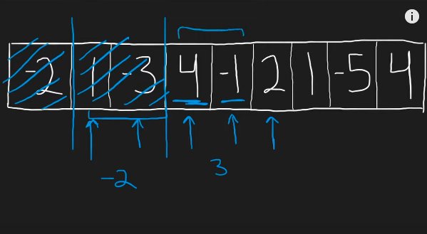

## Leetcode Explanation - Maximum Subarray

*provided by @Neetcode*

[](https://www.youtube.com/watch?v=5WZl3MMT0Eg)
[](https://leetcode.com/problems/maximum-subarray/description/) 

## Drafting & Initial Takeaways

* First approach is brute-force
  
  * Finding subarray starting at every index
    
    * 2 for loops & then compute sum - O(n^3) time complexity
    
    * Very inefficient

* Second approach is brute-force but quadratic
  
  * Finding subarray sum at every index
    
    * 2 for loops and appending sum ever iteration - O(n^2) time complexity

## Implementation

* When finding the maximum subarray, <u>do you need to check & start at every single value?</u>
  
  * **No!**
    
    * If the subarray sum before a positive number is negative, then this subarray does NOT need to be considered
    
    * Recalculate the maximum subarray at starting at the new postiive number's index

* When processing, we may encounter *negative* values
  
  * The negative will decrease our sum but if the sum is **still positive**, the <u>net benefit for future terms</u> is positive as well
    
    * Therefore we keep this prefix



* After adjoining every element, check if the sum exceeds the largest
  
  * If so, update

* Similar to a Sliding Window

## Algorithmic Takeways & Tells

1. As opposed to splitting off into two-pointer, HashMap, etc. approaches, focus on how to optimize & improve the *bruteforce* solution
   
   1. Consider what the bruteforce is addressing, and which operations are <u>not necessary</u>

2. EXAMPLE - O(n^2) is checking every subarray at every index
   
   1. But since we're looking for the **maximum** subarray sum, do we need to check subarrays starting at *negative* values?
   
   2. Nope. Hence the solution to "remove negative prefixes"

## Complexity Analysis

- Time - O(n)
  
  - Iterating through entire array once

- Memory - O(1)
  
  - No additional, n-based structures other than input

## Code

```java
class Solution {
    public int maxSubArray(int[] nums) {
        int sum = nums[0];
        int largest = sum;

        for (int i = 1; i < nums.length; i++) {
            // check prefix's sum
            if (sum < 0) {
                sum = 0;
            }

            // adjoin element
            sum += nums[i];

            // check sum
            if (sum > largest) {
                largest = sum;
            }
        }

        return largest;
    }
}
```
