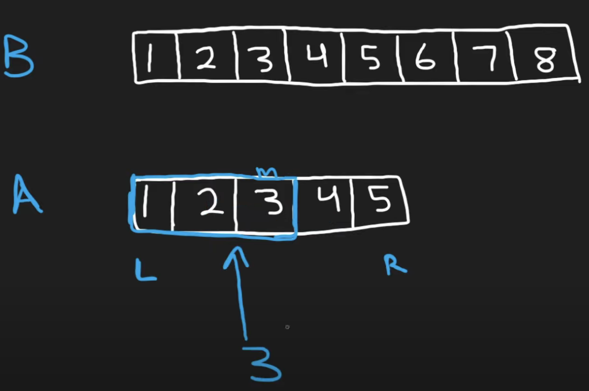
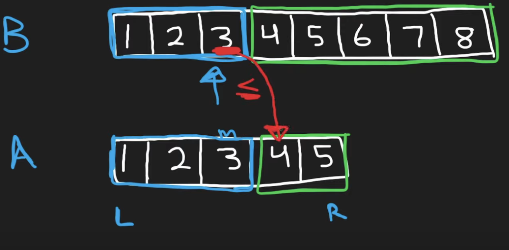
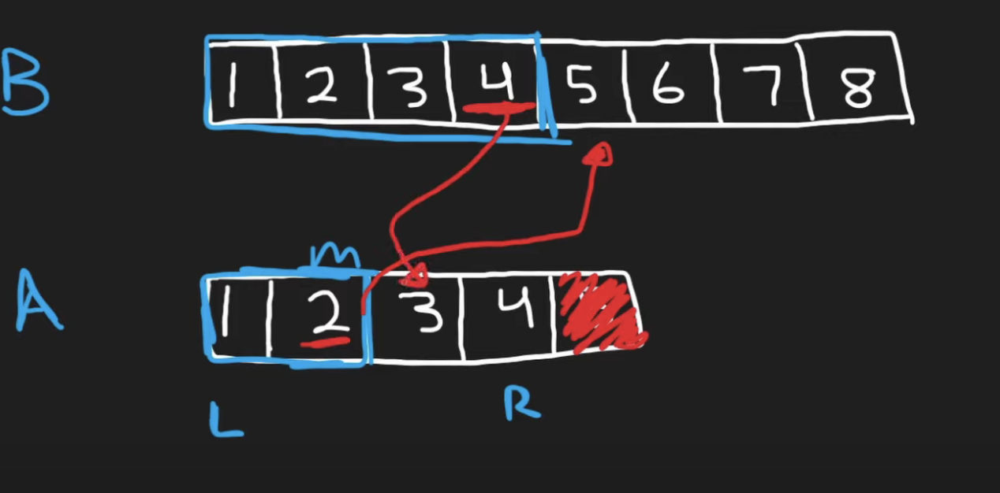
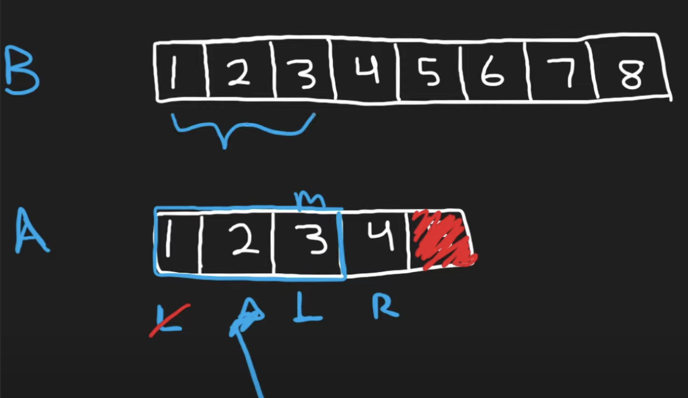

## Leetcode Explanation

*provided by @Neetcode*

[Median of Two Sorted Arrays - Binary Search - Leetcode 4 - YouTube](https://www.youtube.com/watch?v=q6IEA26hvXc) 

### Initial Takeaways

* This problem is hard to implement due to corner cases. Often handling arrays of even and odd lengths are seperated. However, these test cases can be combined.

* When a runtime of log is desired, binary search is used

### Conceptual - Rethinking "medians"

Using a sorted array, a median can be thought of as **an element that partitions the array into 2 equal halves.**

- When length is even, the average of the *right-most* of left partition and *left-most* of right partition can be found

How can you simulate this merging... without actually merging?

```
Total # of elements: 13
Total # of elements in half: 6 (always round down)
```



Consider 2 arrays A and B. A's middle index is found to be 2. Let's consider indices 0-2 to be apart of the *left* partition. If a single partition's total should be 6 and indices 0-2 span 3 elements, then the left partition **needs 3 more elements**. Therefore, we pull 3 elements from B. 

`[ 1 1 2 2 3 3 X 4 4 5 5 6 7 8 ]`

How do we know if we found the correct left partition?

1. All partition's elements should be in order. We already know this is true due to the arrays being sorted.

2. Need to ensure left partition is **>= all elements in right partition**. 



* *Ensuring B's left-pedge is less than A's right-p edge*

* *Ensuring A's left-p edge is less than B's right-p edge*

If these conditions are satisfied, **the left partition is correct.**

With this complete, we understand that the **median is left-most element of the right partition**. To retrieve this, we use the *min* of the both arrays' right partitions.

### Conceptual - Binary Search

In the previous example, a binary search wasn't needed. Now, let's remove array A's last element and consider this:



Using A, we find the middle index to be at 1. 12 elements in total so a partition's size is 6. Indices 0-1 cover 2 elements, so 6-2 = 4, the partition needs 4 more elements!

These elements are pulled from B's left side. Now we check the conditions.

All partition's elements are in order...

BUT **'4' in the left partition is not less than or equal to '3' in the right partition**. So the partitions have been done incorrectly.

* This means they have to be redone, with our initial 'L' and/or 'R' pointers altered

Since we understand that we need extra elements from array A to be in the *left partition*, we update the 'L' pointer to be `mid_index + 1`.



Now that we've repartitioned, let's begin the condition check.

* Most right element of left partition is LESS than all elements of right partition

### Conceptual - Considering different lengths

For the 1st example, the length was odd. So when factoring both partition's edges, *Min* was used. However, **now the length is even**. 

* To solve this, the *maximum* from the Left partition and the *minimum* from the Right partition must be used.

To pull these boundary values when handling TWO, SEPARATE arrays, *Max* and *Min* needs to be applied

1. max(A's most right element in LP, B's most right element in LP)

2. min(A's most left element in RP, B's most left element in RP)

Finally, divide these values' sum by 2. 

When handling corner cases with partitions with 0 length, the values `infinity` and `-infinity` can be used to work with the condition check.

### Code

```python
# Time: log(min(n, m))


class Solution:
    def findMedianSortedArrays(self, nums1: List[int], nums2: List[int]) -> float:
        A, B = nums1, nums2
        total = len(nums1) + len(nums2)
        half = total // 2

        if len(B) < len(A):
            A, B = B, A

        l, r = 0, len(A) - 1
        while True:
            i = (l + r) // 2  # A
            j = half - i - 2  # B

            Aleft = A[i] if i >= 0 else float("-infinity")
            Aright = A[i + 1] if (i + 1) < len(A) else float("infinity")
            Bleft = B[j] if j >= 0 else float("-infinity")
            Bright = B[j + 1] if (j + 1) < len(B) else float("infinity")

            # partition is correct
            if Aleft <= Bright and Bleft <= Aright:
                # odd
                if total % 2:
                    return min(Aright, Bright)
                # even
                return (max(Aleft, Bleft) + min(Aright, Bright)) / 2
            elif Aleft > Bright:
                r = i - 1
            else:
                l = i + 1
        
        
```
