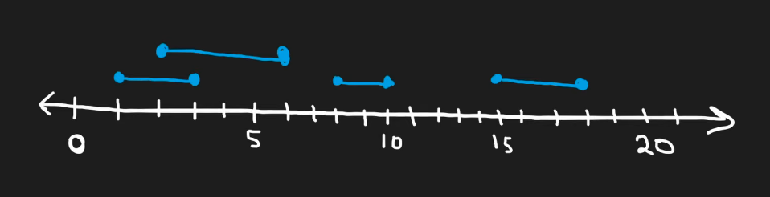
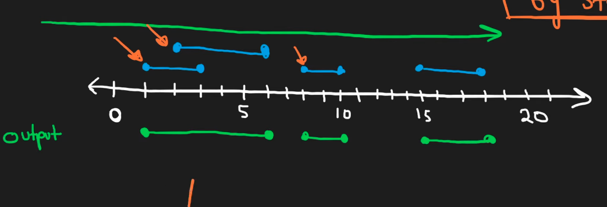

## Leetcode Explanation - MergeIntervals

*provided by @Neetcode*

[](https://www.youtube.com/watch?v=44H3cEC2fFM)
[](https://leetcode.com/problems/merge-intervals/description/) 

## Drafting & Initial Takeaways

* Overview
  
  * Given an array of intervals, merge all overlapping intervals & output an array of *non-overlapping* intervals
    
    * EX: ([1,3], [2,6], [8,10], [15, 18]) **--->** ([1, 6], [8,10], [15, 18])

## Implementation

* Imagine being given these intervals but in <u>unsorted order</u>
  
  * Tracking where overlaps occur would be more difficult
  
  * Hint that we want to *maintain* sorted order

* Tracking on a number line
  
  
  
  * When processing the number line, we notice that we want the intervals <u>ordered by their **starting values**</u>
    
    * Allows us to accurately identify overlaps sequentially
    
    * If space exists between 1 intervals end & next's starting value, there is NO overlap

* Therefore sort the intervals based on their *starting values*

* Then, begin processing and merging intervals as needed



## Complexity Analysis

* Time - O(n * log(n))
  
  * Sorting intervals then processing every interval

* Memory - O(n) 
  
  * Creating new output to hold non-overlapping intervals

## Algorithmic Takeways & Tells

* When a problem's examples are given in *sorted* order, it may be best to pursue sorting it

* Use visual representations when dealing with intervals! i.e. **Timelines!**

## Code

```java
class Solution {
    public int[][] merge(int[][] intervals) {
        // Sort.
        List<int[]> sorted = Arrays.asList(intervals);
        sorted.sort((a, b) -> Integer.compare(a[0], b[0]));

        // Merge overlaps.
        Stack<int[]> output = new Stack<>();
        int[] latest; int[] curr;

        output.push(intervals[0]);  // Init output with first interval.
        for (int i = 1; i < sorted.size(); i++) { // Iterate over remaining.
            latest = output.peek();
            curr = intervals[i];

            if (latest[1] >= curr[0]) {
                latest[1] = Math.max(latest[1], curr[1]);    // Overlap found, update latest interval.
            } else {                        
                output.push(curr);      // No overlap, add curr interval.
            }
        }

        return output.toArray(new int[output.size()][2]);
    }
}
```
