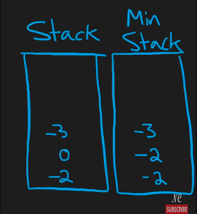

## Leetcode Explanation - MinStack

*provided by @Neetcode*

[](https://www.youtube.com/watch?v=qkLl7nAwDPo&t=304s)
[](https://leetcode.com/problems/min-stack/description/) 

## Drafting & Initial Takeaways

- Design a stack supporting 4 operations
  
  - `push()`, `pop()`, `top()`, `getMin()`
  
  - However, all these operations need to function <u>in O(1) time</u>
    
    - The problem comes from **retrieving the min**

## Implementation

* Implementing the stack
  
  * We can compare & accordingly update the *minimum* when pushing new values
    
    * However, if we store this <u>in a single var</u>...
      
      * What occurs if we POP the value holding our minimum?
      
      * [-2, 0, -3] | -3 is min -> -3 popped leaving [-2, 0], how can we decipher the next minimum in a **constant time**?
    
    
    
    * Implement **an additional stack tracking the mins at every value**
      
      * For every *push*, push onto the min_stack the current min
      
      * For every *pop*, also pop for the min_stack

## Complexity Analysis

* Time - O(n)
  
  * All stack operations are constant, including `getMin()` via the new stack

* Memory - O(2n) - O(n)
  
  * 2 stacks, both the size of 'n' elements pushed on

## Algorithmic Takeways & Tells

* When tracking a distinct value within a data structure, explore utilizing **additional structures** to track the <u>collection's properties</u> during processing

## Code

```python
class MinStack:
    def __init__(self):
        self.stack = []
        self.minStack = [] # stack tracking mins

    def push(self, val: int) -> None:
        self.stack.append(val)

        # compare most recent min to val & add smallest to minStack
        val = min(val, self.minStack[-1] if self.minStack else val)
        self.minStack.append(val)

    def pop(self) -> None:
        self.stack.pop()
        self.minStack.pop()

    def top(self) -> int:
        return self.stack[-1] # most recent val

    def getMin(self) -> int:
        return self.minStack[-1] # most recent min
```
