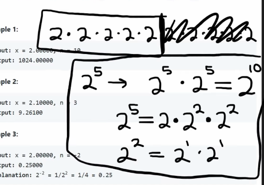

## Leetcode Explanation

*provided by @Neetcode*

[](https://www.youtube.com/watch?v=g9YQyYi4IQQ)
[](https://leetcode.com/problems/powx-n/description/) 

## Drafting & Initial Takeaways

* Implementing *pow(x,n)* deals with implementing X^n
  
  * X^n = x * x * x * x * ...
  
  * Problem seems simple enough w/ this this reptition, but what about *negative* exponents?
    
    * A negative exponent is equal to 1 divided by the postiive exponent
    
    * 2 ^ -2 == 1/(2^2)

* Considering this, solving the problem in <u>linear time</u> is fairly simple
  
  * Implement a for-loop and handling for negative exponents

* Issue arises when solutions O(n) runtime does NOT pass all the testcases!

## Implementation

* Consider "2 * 2 * 2 * 2 * 2 * 2"
  
  * Instead of multiplying these values, we could take half (2 * 2 * 2 = 2^3) and double it!
  
  * But 2^3 can be broken down further
    
    * 3/2 = 2, remainder 1 => (2^2) * 2



* This pattern resembles a **logarithmic function**
  
  * "How many times can you divide a number by 2 until it equals 1?"

* Recursive pattern
  
  * The process of finding 2^10 will be much easier by first finding 2^5
    
    * Which would exceedingly be easier per 2^2 * 2 and so forth
  
  * Recursing to bottom of stack, then popping back
  
  * Base cases
    
    * For exponents -> if n = 0, return 1
    
    * For base values -> if x == 0, return 0

## Complexity Analysis

* Time - O(logn)
  
  * Instead of iterating 'n' times, the exponent will half 'log n' times

* Memory - O(1) *constant* or O(d) for recursion depth
  
  * No additional data structures, just recursive stack

## Code

```java
class Solution {
    public double myPow(double x, int n) {
        double result = myPowRecurse(x, Math.abs(n));
        result = n < 0 ? 1.0/result : result;
        return result;
    }

    public double myPowRecurse(double x, int n) {
        // Base cases
        if (x == 0) { // 0 base, will always be 0
            return 0.0;
        }
        if (n == 0) { // 0 exponent, will always be 1
            return 1.0;
        }

        // Recursive step
        double result = myPowRecurse(x, n/2); // find half
        result *= result;                     // multiple by itself to get whole

        if (n % 2 != 0) {  // Factoring in any multiple remainders
            result *= x;
        }

        return result;
    }
}
```
