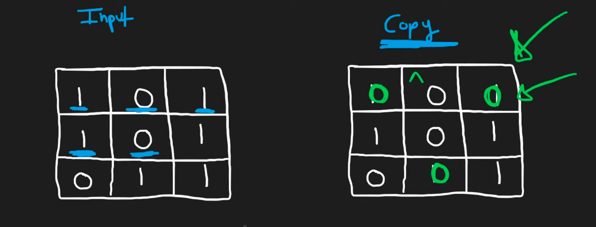
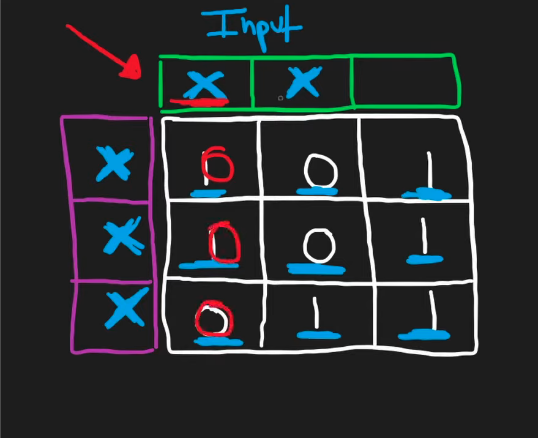
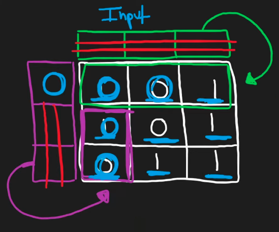

## Leetcode Explanation - Set Matrix Zeros

*provided by @Neetcode*

[](https://www.youtube.com/watch?v=T41rL0L3Pnw)
[](https://leetcode.com/problems/set-matrix-zeroes/description/) 

## Drafting & Initial Takeaways

* Given a matrix, if an element is 0, set its *row* and *column* to 0s as well

* Difficulty comes from discerning **true zeros** to **fabricated zeros** 

* Various solutions ranging from O(m*n) memory to O(1)
  
  * O(m*n)
    
    * Create <u>a copy of the matrix </u>& update this copy's values according to 0s
    
    * Maintain the original input to avoid processing *fabricated* zeros



*  Notice that in the above approach that we can find *additional zeros* in the input matrix whose rows & columns <u>have already been processed</u>
  
  * However, our algorithm will set "copy's" values to 0 
  
  * This is a **wasted computation**

* Optimizing O(m*n) to O(m + n)
  
  * Instead of an additional matrix, utilize *2 data structures*
    
    * One holding the <u>num. of rows</u> and one holding the <u>num.  of columns</u>
  
  * When parsing the input, track which rows & columns will be set to 0
    
    * **BUT** don't modify anything yet, to avoid processing *fabricated zeros*
  
  * After all columns & rows found, set all according pathes to 0 



## Implementation

- How about a **constant memory** solution? 
  
  - Is it possible to place the data structures tracking *rows* and *columns*... and <u>place them into our matrix</u>?
    
    - **YES!**
  
  - Instead of creating new structures, use the *top row* & *left column* to track which rows & cols are **zeroed out**
    
    - The top row & left column have an overlap at (0,0), so use an additional integer to for this space
    
    - Memory remains O(1) - *constant*
  
  - This solution works because <u>we iterate *left* to *right*, *top* to *bottom*</u>



## Complexity Analysis

- Time - O(m*n)
  
  - Going through every coordinate

- Memory - O(1)
  
  - 1 extra variable + using input array's top rop & left column to track 0s applied

## Algorithmic Takeways & Tells

* Implement the brute-force **FIRST** and look at how it can be optimized!

* See how data structures tracking coordinates and/or states can be *simplified* or *integrated* into the ORIGINAL input structure

## Code

```java
class Solution {
    public void setZeroes(int[][] matrix) {
        int rows = matrix.length;
        int cols = matrix[0].length;
        boolean firstRow = false; // Constant memory, tracking 1st row's 0 status

        // Check for 0s and modify 1st row & 1st column accordingly
        for (int i = 0; i < rows; i++) {
            for (int j = 0; j < cols; j++) {
                if (matrix[i][j] == 0) {
                    
                    // Mark ROW - for tracking columns
                    matrix[0][j] = 0;

                    // Mark COLUMN -  for tracking rows (use 'firstRow' if [0][0])
                    if (i == 0) {
                        firstRow = true;
                    } else {
                        matrix[i][0] = 0;
                    }
                }
            }
        }

        // Process matrix values EXCLUDING 1st row & column
        // [ X X X ]
        // [ X 0 0 ]
        // [ X 0 0 ]
        for (int i = 1; i < rows; i++) {
            for (int j = 1; j < cols; j++) {
                if (matrix[0][j] == 0 || matrix[i][0] == 0) {
                    matrix[i][j] = 0;
                }
            }
        }

        // Check if 1st column contains 0 
        if (matrix[0][0] == 0) {
            for (int i = 0; i < rows; i++) {
                matrix[i][0] = 0;
            }
        }

        // Check if 1st row contains 0
        if (firstRow) {
            for (int j = 0; j < cols; j++) {
                matrix[0][j] = 0;
            }
        }
    }
}
```
