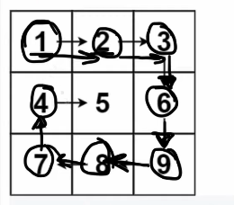

## Leetcode Explanation - Spiral Matrix

*provided by @Neetcode*

[](https://www.youtube.com/watch?v=BJnMZNwUk1M)
[](https://leetcode.com/problems/spiral-matrix/description/) 

## Drafting & Initial Takeaways

- Given a matrix, return its elements in spiral order
  
  
  
  - Examining this spiral process, you can noptice that the matrix has *shrinked*
    
    - The boundaries have shifted: 'Left' , 'Right', 'Top', 'Bottom'
      
      - L & T: 0 -> 1
      
      - R & B: length -> length -1
  
  - When a spiral meets its end and <u>processes all elements</u>...
    
    - The corresponding boundaries are the *same* or have *crossed each other*

## Implementation

* Initialize boundaries (ptrs)
  
  * L and T at 0
  
  * R and B at length(matrix), 1 increment past ending element
    
    * Outside matrix's bounds but makes code easier

* Processing
  
  * Processing 1st row from L to R (R signaling to "stop")
    
    * After processing the 1st row, the <u>matrix's shape of available elments</u> has changed
      
      
    
    * Decrement T (top boundary) to fit this new shape
  
  * Now process the column going from T to B
    
    * But once again, the matrix's shape has shifted
    
    * Decrement R to fit this new shape
  
  * Process the row from R to L
    
    * Matrix's shape shifted, excluding the bottom row. So B can be incremented to fit
  
  * Now when processing column from B to T...
    
    * We stop at T, and don't risk processing elements already used bc <u>the T boundary was decremented</u> after the 1st operation
    
    * Afterwards, left column is processed so increment L to fit new shape


* The problem has accordingly *been reduced*
  
  * Top, Left, Bottom, and Right sides have been **chopped**

* Stop condition
  
  * We then process row [6,7] from L to R. Afterwards, T is decremented to reflect this top row being processed
  
  * BUT now T and B are <u>pointing at the same row</u>
    
    * Also applicable if L and R meet
  
  * Therefore all elements have been processed and we can stop 
  
  

## Complexity Analysis

* Time - O(m*n)
  
  * Processes every element within the matrix

* Memory - O(1)
  
  * No extra memory saved
    
    * Excluding output as extra memory 

## Algorithmic Takeways & Tells

* When analyzing a "visual", look for & identify patterns in how the visual <u>changes during processing</u>
  
  * I.e. After 1 full spiral, the grid shrinks a level in all dimensions

* Utilize **pointers** for problems w/ *changing boundaries*

## Code

```java
class Solution {
    public List<Integer> spiralOrder(int[][] matrix) {
        int height = matrix.length;
        int width = matrix[0].length;
        List<Integer> res = new ArrayList<>();

        // use pointers denoting boundaries
        // different implementations for top, bottom, left, and right
        // increment/decrement pointers to mark as processed

        int top = 0;
        int left = 0;
        int bottom = matrix.length;
        int right = matrix[0].length;

        while (top < bottom && left < right) {
            // process top row
            for (int i = left; i < right; i++) {
                res.add(matrix[top][i]);
            }
            top++;
            // process right column
            for (int i = top; i < bottom; i++) {
                res.add(matrix[i][right-1]);
            } 
            right--;

            if (top >= bottom || left >= right) { 
                break; // spirals end after processing columns - w/o this, row elements are rpeeated
            }

            // process bottom row
            for (int i = right-1; i >= left; i--) {
                res.add(matrix[bottom-1][i]);
            }
            bottom--;
            // process left column
            for (int i = bottom-1; i >= top; i--) {
                res.add(matrix[i][left]);
            }
            left++;
        }

        return res;
    }
}
```
